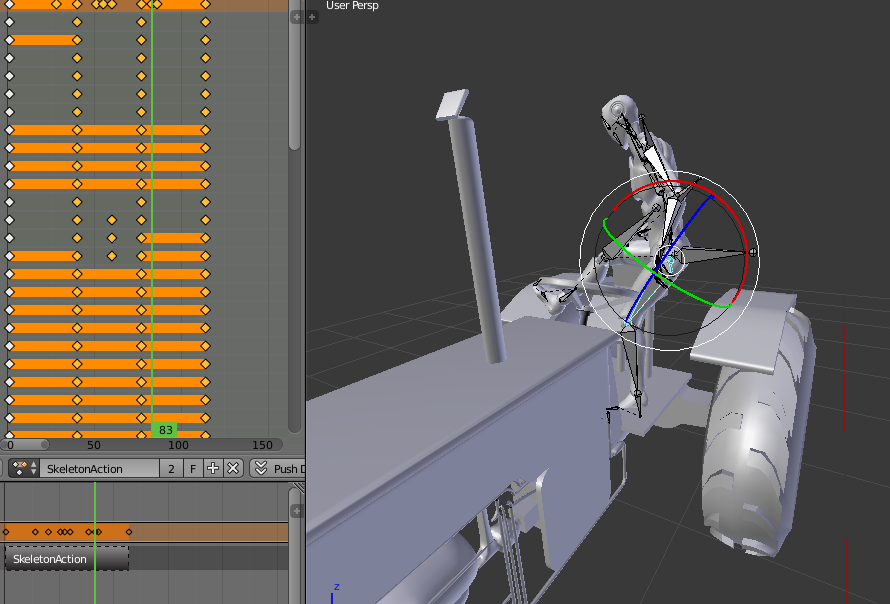
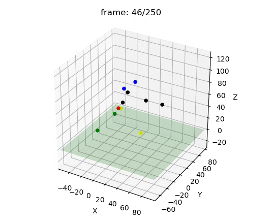

# Farming Simulator Blender Files

### .blend files were made with Blender 2.79

This repository contains the .blend files and exported .fbx and .obj models that are used in our farming simulator.

## .npz Conversion

### Importing

import_npz.py is a python script that at the moment will import reverse_engineering_test.npz in the same directory as the Blender project.

### Exporting

export_npz.py is a python script that when run, will convert a selected skeleton to a .npz format to be used with IsaacLab. To run it, simply open a project, and select a skeleton. Then, open a new window bar, and choose text editor. In the editor, open the export_npz.py file and then click Run Script. It will output a .npz file in the same directory as the Blender project.