# Overview

The blender is designed to make assests for our farming simulator. Overall, the blender is able to make multiple assests including multiple kinds of the fruits, machines, and robots.  

The example of the humanoid is in the below:

This repository contains the .blend files and exported .fbx and .obj models that are used in our farming simulator.

### Note that: .blend files were made with Blender 2.79

# Tutorial 

In the following, I will show you how to do aapple assests making using the blender and once finished, it can be expored to Unity 

## VGGT Post-Processing and Export

Remeshed VGGT pointclouds need to be processed in Blender before they can be exported to Unity.

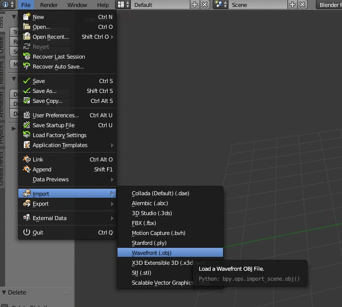

1. Import the remeshed pointcloud .obj (processed by MeshLab) into Blender.

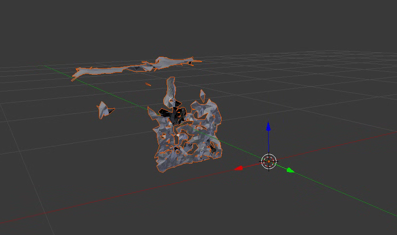

2. It should look like this. Press TAB to go into edit mode.

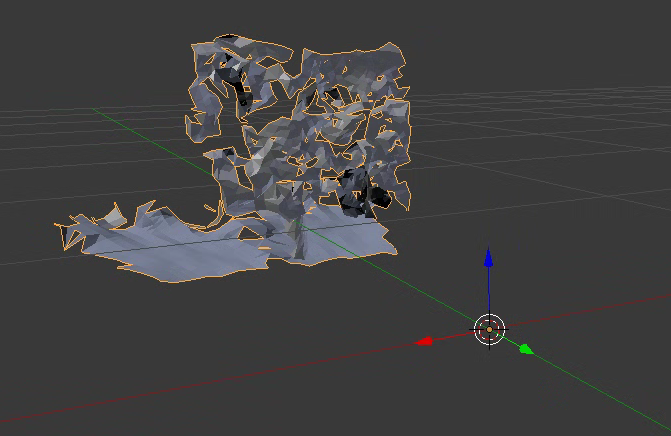

3. Rotate the mesh 180 degrees along the Y axis.

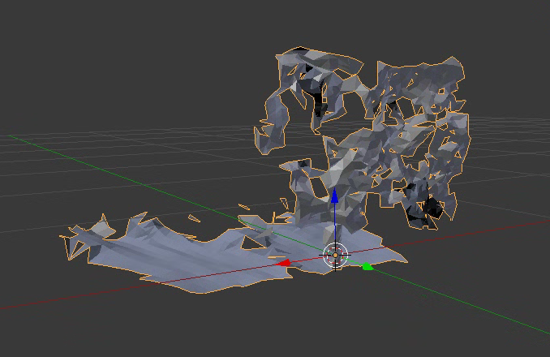

4.  Move the center of the fruit/plant to be located at the origin. This typically only involves moving the mesh in the direction of the green arrow.

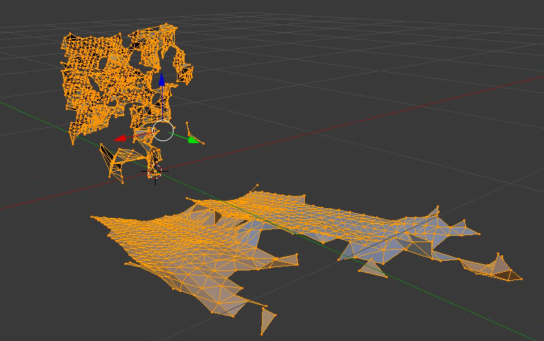

5. Rotate the mesh along the Z axis 180 degrees, so that the back of the mesh is pointing the same direction as the green arrow.

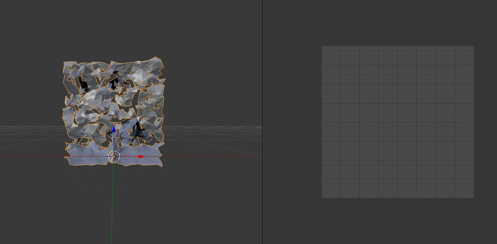

6. Split the view into the 3D viewer and the UV image editor. Then press numpad 1 to view the model from the front. Zoom in and hold shift + middle mouse button to move the view until the front of the mesh is roughly square shaped.

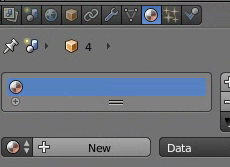

7. Exit edit mode, and create a new material in the materials tab.

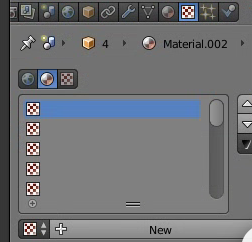

8. Once a new material is created, go to the texture tab and create a new texture.

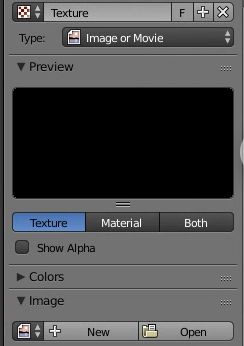

9. After making the new texture, click the open button, and selected the mesh's texture, typically located in the Data/vggt_images/ folder.

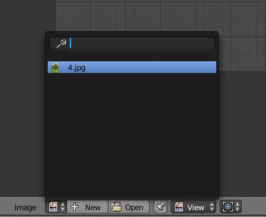

10. Open the image preview in the UV image editor.

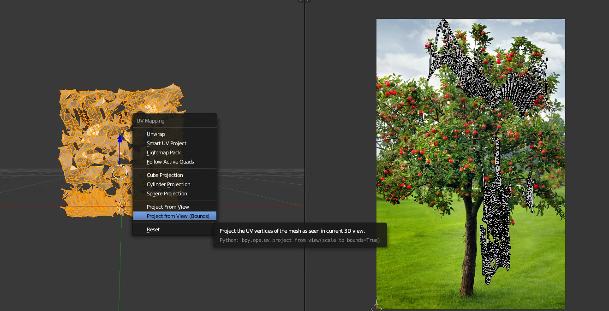

11. Select the mesh, go into edit mode, and select all the vertices. Then press U, and choose Project from View (Bounds).

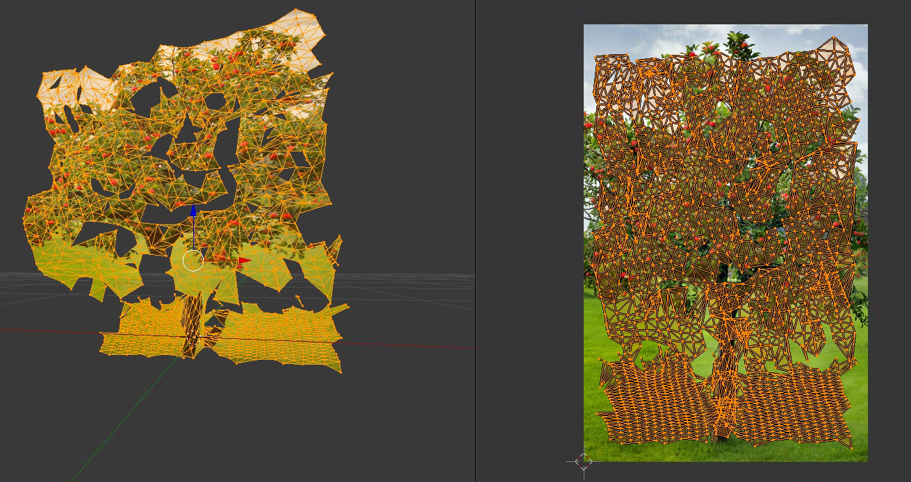

12. The UV layout should be roughly square shaped in the UV Image Editor. scale and move the UVs to match the mesh. You can go into Texture preview mode to preview the mesh and its texture in the 3D view.

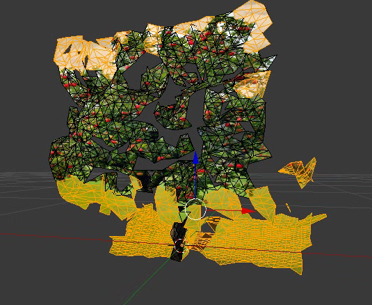

13. While in edit mode, select faces of the mesh that should be deleted (background). Select face mode, and press C to use the circle select tool to more easily select them.

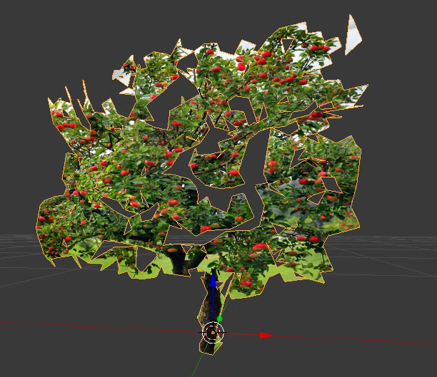

14. Delete these faces, and exit edit mode.

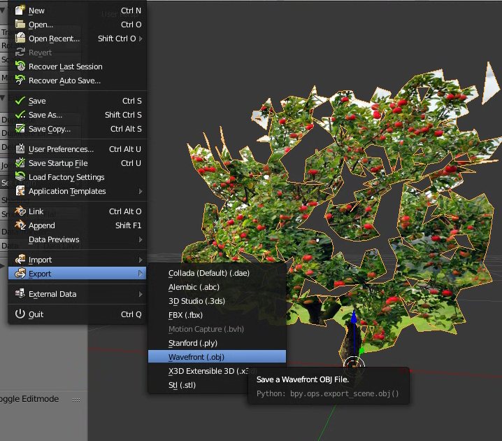

15. Export the mesh as an .obj to the output/ folder.

# File Conversion.

Here are the handy tools for file conversion to make assets workable with blender. 

## .npz Conversion

### Importing

import_npz.py is a python script that at the moment will import reverse_engineering_test.npz in the same directory as the Blender project.

### Exporting

export_npz.py is a python script that when run, will convert a selected skeleton to a .npz format to be used with IsaacLab. To run it, simply open a project, and select a skeleton. Then, open a new window bar, and choose text editor. In the editor, open the export_npz.py file and then click Run Script. It will output a .npz file in the same directory as the Blender project.

### Preview

You can preview a .npz animation with the command:

	motion_viewer.py --file <file.npz>
	
Matplotlib, Numpy, and PyTorch are required to run.

motion_loader.py is used to view statistic of a .npz animation. To run:

	motion_loader.py --file <file.npz>

## MoMask / .bvh Conversion

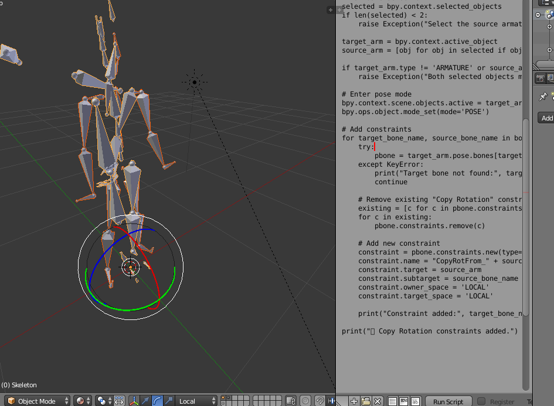

### Automatically

You can use .bvh files generated by [MoMask](https://github.com/EricGuo5513/momask-codes) to create animations too.

	blender -b -P bvh_to_fbx.py -- ../falling_down.bvh

### Manually

Open a new Blender project with the Unity humanoid skeleton. Then import the .bvh file. Now first select the .bvh skeleton, then shift-right-click the Unity skeleton so that it is yellow. Then open a new text editor window, open **convert_bvh.py**, and run it. The animations should now be converted to the Unity skeleton, and you can export it.

For either case, drag and drop the exported .fbx animation files into the Unity Assets folder for use in animations.